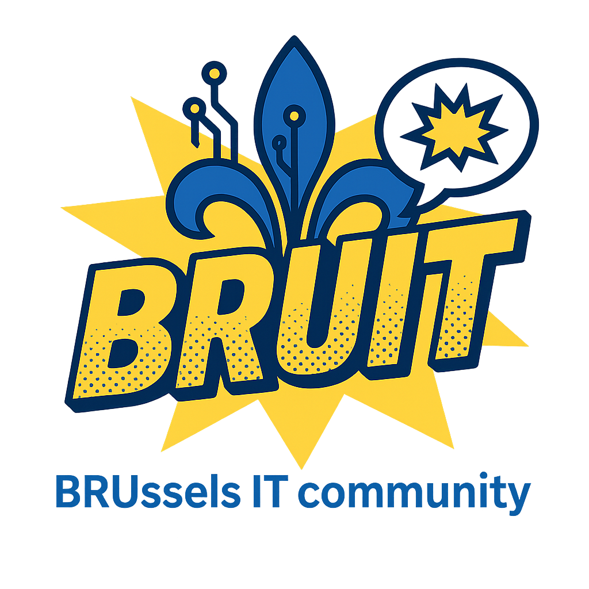

# BRUIT - Brussels IT Community

**BRUIT** is Brussels' premier IT community where innovation meets collaboration. We bring together passionate developers, engineers, and tech enthusiasts who are shaping the future of technology in the heart of Europe.

## 🌟 What Makes BRUIT Special

### 🤝 **Community First**
Connect with like-minded IT professionals in Brussels. Share knowledge, collaborate on projects, and build lasting relationships.

### 💡 **Innovation Hub**
Stay ahead of the curve with the latest tech trends, workshops, and networking events in the Belgian tech scene.

### 🚀 **Skill Development**
Enhance your technical skills through code reviews, pair programming sessions, and collaborative learning opportunities.

### 🌍 **Brussels Network**
Connect with professionals from various tech backgrounds and industries across Brussels and the surrounding region.

### 📅 **Growing Events**
Participate in meetups, hackathons, tech talks, and social events designed to foster collaboration and growth.

### 🎯 **Career Growth**
Discover new opportunities, mentorship programs, and career advancement resources within the IT community.

## 🎉 **Join Our Community**

Whether you're a seasoned developer or just starting your tech journey, BRUIT provides the perfect environment to learn, grow, and connect with fellow professionals.

**[Join BRUIT on Discord](https://discord.gg/ZzdU8cum)**

---

**Building the future of Brussels' IT community together!** 🚀
